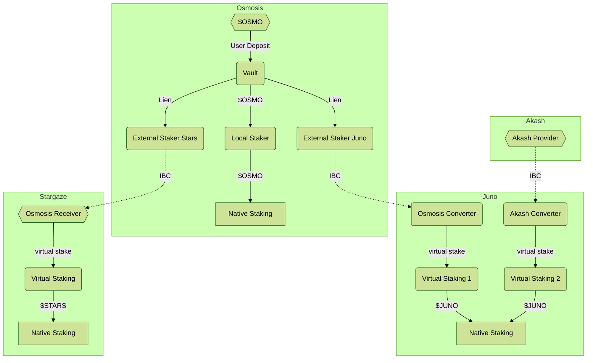

# Mesh Security Architecture

This is an architectural overview of the various components of Mesh Security.
These attempt to explain a full-refined v2 state. As needed, we will include
simplifications used for MVP (testnet) or v1 (production-ready, feature-limited)
as footnotes in the documents.

You can get a good overview of the whole system flow in the above diagram. 
The design should allow one chain to provide security to multiple chains, while
at the same time receiving security from multiple chains. 

A key to understanding the design, is that the whole system is _delegator-centeric_ 
not _validator-centric_. This means that we don't try to match the same validators on
multiple chains, or even subsets, but rather focus on leveraging the security
provided by staking tokens to secure validators on multiple chains.  This provides a way to
scale bidirectionally, while avoiding some sort of infinite-loop recursion, as
chains can only provide security in their native token(s).

## Use Cases

Before we dig into the architecture of Mesh Security, please take a look at
the [use cases we aim to serve](./UseCases.md).

## Common Concerns

Addressing some common points people raise up, which are hidden in the docs.

### Fractional Reserve

There are many questions if this isn't "fractional reserve banking" or such.
This does use the same collateral to back multiple claims (staking), but
the [final invariant in the vault](https://github.com/osmosis-labs/mesh-security/blob/main/contracts/vault/README.md#invariants) 
ensures there is sufficient collateral to cover the maximum loss
(eg. if all local and cross-staked validators double-sign).
If the double slash penalty is 5%, you can safely cross stake 20x.
If it were to be raised to say 40%, you could only safely cross stake 2.5x
This is more like insurance companies holding reserves for the worse cases expected losses,
not the total value of all property insured.

### Power Limits on Remote Chains

Another common concern is whether there are effective limits in the power a remote
chain can exert over one chain. Would it be possible for a higher cap chain (eg $ATOM)
to take over more than one-third, or even two-thirds or the power of a smaller cap chain
(eg $STARS) it is cross-staking on. 

Clearly the consumer chain wants to put some limits. The first limit is the 
[discount applied during the conversion](https://github.com/osmosis-labs/mesh-security/blob/main/docs/consumer/Converter.md#price-normalization).
This doesn't just provide margin for price fluxuations but also means that on average
a remote token has less voting power (and rewards) per USD-value than a local token, favoring
local stakers.

In addition, the Virtual Staking module enforces a
[max cap per provider](https://github.com/osmosis-labs/mesh-security/blob/main/docs/consumer/VirtualStaking.md#module).
This limits how many virtual tokens a given provider can stake.
For computational reasons, it is defined as a number of tokens, not a percentage of stake,
but looking at an average number of local tokens staked, the chain governance on
the consumer chain can select appropriate values for each provider.
This max cap can be updated by governance as needed, so if a lot more (or less) local
tokens are staked, the max cap of the providers can be updated with a gov vote to
keep them in reasonable limits.

### Failure Modes

There are three main failure modes to consider:

* Huge price swing (provider token rises/falls relative to consumer token).
* Provider goes Byzantine and tries to mint arbitrary unbacked tokens.
* Consumer goes Byzantine and tries to slash/lock tokens on the provider side.

#### Huge Price Swing

This is the most likely scenario. If the provider price rises too much, it may suddenly have
disproportionate power over the affairs of the consumer. If the provier price falls too much,
in the period until the price oracle is updated, there may be less remote collateral
than the virtual stake.

For price increases, we have the max cap described under "Power Limits" which places a cap
on the provider chain's influence in all circumstances, so this isn't a large problem.

For a rapid price decrease, we must consider the time frame.
It is a [requirement of an oracle](https://github.com/osmosis-labs/mesh-security/blob/main/docs/consumer/Converter.md#price-feeds)
to provide timely feeds, say once a day or week, so we should focus the relative price movement
in such a period. [The discount](https://github.com/osmosis-labs/mesh-security/blob/main/docs/consumer/Converter.md#price-normalization)
provides such a buffer. If there is a discount of 40% and the provider tokens drop 30% relative to
the consumer tokens in one oracle epoch, then it is still over-collateralized relative to voting power.
If, however, it falls 60%, then it would only have 2/3 of the collateral locked on the provider
as it has voting power on the consumer.

This could be a possible attack vector, but should be minimized by selecting a sensible discount
value based on the volatility of the two assets and the update frequency of the price oracle.
Furthermore, it does require staked assets on the provider, which entails locking capital
for multiple weeks, so it is not susceptible to flash-loan style attacks. It also has the
max cap limit preventing total takeover, so it just provides overly high rewards for a brief period.

#### Byzantine Provider Chain

The worst case is the provider claims to deposit millions of tokens on one malicious validator,
while not actually locking any collateral on it's own chain. This is similar to the case of
a hostile community on the provider chain selecting validators against the interest of the
community on the consumer chain.

Once again, the max cap limit prevents total take over, so this damage may be limited to say 5% or
15% of the voting power. A consumer chain must be very careful before authorizing a provider to
mint anywhere near 30% of their stake, as this gets close to a one-third attack.

Furthermore, unless the provider manages to gain one-third of the stake, the consumer governance
would quickly pass a proposal to reduce the max cap of that provider to zero and thus removing
the threat. That only works if the attacker cannot control the chain during the voting period,
so the max caps for providers should be considered carefully, especially relative to their
perceived stability.

#### Byzantine Consumer Chains

If a Consumer Chain goes Byzantine (or starts some mob-rule governance proposals), it can
try to damage stake on the Provider chain. There are several ways it can try to do so:

* Withholding all rewards to said Provider
* Removing all voting power from said Provider
* Refusing to unlock the virtual stake of the Provider
* Unfairly slashing virtual stake from the Provider

The first two are temporary and can be seen in the case when the consumer no longer trusts the
provider and sets "max cap" to zero. This is a temporary effect but must be acknowledged as 
a possible risk, which is loss of benefits, but not loss of collateral.

The third point is impossible, as the unlock period is implemented between the external staking
contracts and the vault on the provider side. Nothing on the Consumer can lock up stake longer.
And if a Provider feels they have unfairly withhold benefits (first two points), they could
make a governance vote to allow immediate unbonding of all cross-stake to that consumer.

The last point is a bit trickier. We will not fully define slashing until v1, but the design is
that the Consumer cannot initiate slashing via an IBC message, rather they need to submit the
original evidence (multiple headers on the same height signed by the same validator). This will
be verified and punished on the Provider side. A normal state machine bug on the consumer could not
trigger this. An actual double sign (the validator was malicious or made mistake) could trigger it.

However, some malicious code in Tendermint, to double-sign or leak the private key, could trigger
such a condition without the Validators fault. It would require hacks deep into the Tendermint code
(not the custom ABCI app) and a governance upgrade to direct the validators to use it, and we
generally consider this unlikely (it has never been observed in 4+ years of the Cosmos).

## Definitions

* **Pairing** - a trust relationship between two chains, such that one promises to lock up slashable
  stake, while the other leverages this promise to issue validation power in the dPoS system.
  Notably, chain A and chain B may have two pairings in opposite directions at the same time.
* **Provider** _(also "Provider Chain")_ - when looking at one pairing, this is the chain which 
  locks up tokens and provides them as staking collateral to the other chain. 
* **Consumer** _(also "Consumer Chain")_ - when looking at one pairing, this is the chain which
  adjusts validator weights and provides rewards based on remote collateral.
* **Collateral** - Tokens locked up on the provider chain, which are providing security
  guarantees to one or more providers. These tokens may be slashed upon any slashing event
  in the consumers.
* **Staking** _(also "Delegation")_ - The act of providing collateral for a validator, such that the
  staker receives a portion of the block rewards if they behave correctly, as well as the slashing risk
  if they misbehave.
* **Unstaking** _(also "Unbonding")_ - The act of initialing the removal of stake from a system. During
  the "unbonding period", the collateral will not receive any rewards, but will be liable to slashing
  based on misbehavior of that validator.
* **Unbonding period** - The time delay between initiating unbonding and having free access to the
  underlying collateral. Once this time has passed after unstaking, all claims on the underlying
  collateral are released and 
* **Rewards** - Block rewards are issued to validators in the native token of the consumer chain.
  A portion of these rewards goes to the stakers and is collected cross-chain.
* **Slashing** - If a validator misbehaves, the tokens delegated to it, which provided the
  voting power, can be slashed. The percentage of slashing for each misbehavior depends on the chain.
  This slash must be reflected by stakers on the provider chain, but we may make some approximations
  as needed to implement this efficiently.
* **Jailing** - If a validator misbehaves, it may be jailed, or removed from the validator set and
  prevented from returning. Tokens staked to it would be partially slashed and should be unstaked
  as soon as possible, as they will receive no more rewards. Stake to a jailed validator still must
  wait the unbonding period to be liquid.
* **Latency** - Time delay from an action being initiated and the effects being reflected in
  another contract or chain. This doesn't refer to the unbonding period, but rather the delay between
  initiating bonding or unbonding on the provider and the equivalent action occurring on the consumer. 

## Sections

Below are links to detailed documents on various sub-systems:

[Provider](./provider/Provider.md):
  * [Vault](./provider/Vault.md)
  * [Local Staking](./provider/LocalStaking.md)
  * [External Staking](./provider/ExternalStaking.md)
  * TODO - Rust interfaces

[Consumer](./consumer/Consumer.md):
  * [Converter](./consumer/Converter.md)
  * [Virtual Staking](./consumer/VirtualStaking.md)
  * SDK Changes

[IBC Protocol](./ibc/Overview.md):
  * [Cross-Chain Staking](./ibc/Staking.md)
  * [Reward Flow](./ibc/Rewards.md)
  * [Handling Slashing Evidence](./ibc/Slashing.md)
  
