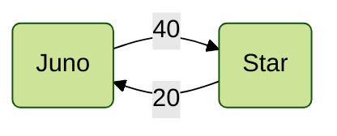
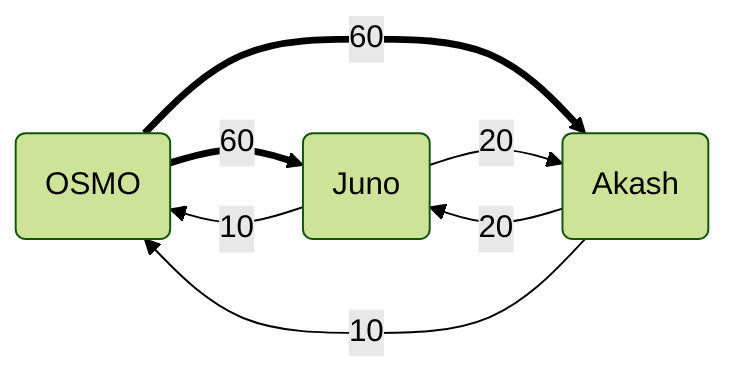
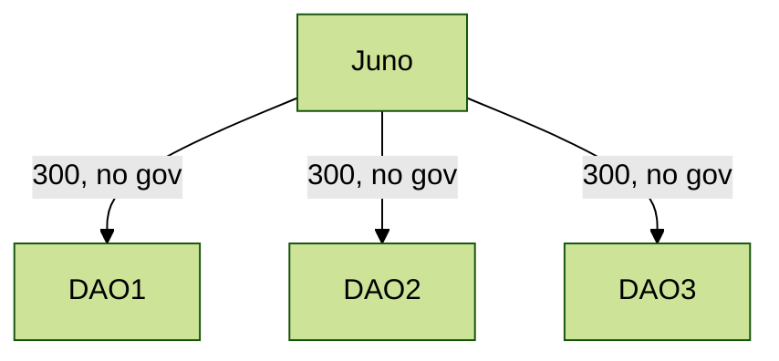
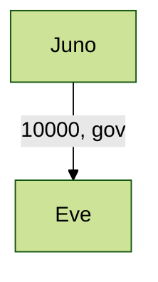
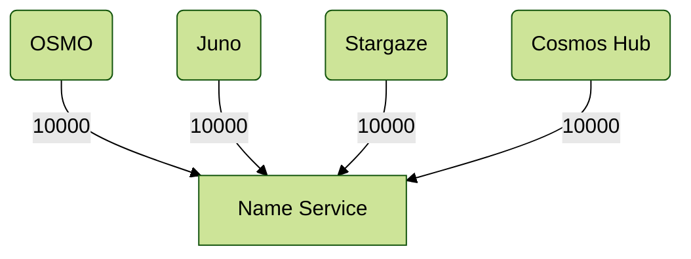

# Use Cases

We assume each chain has a native staking token denom, with some quantity (could be 1 or 1,000,000,000).
This is the initial token to start the chain with. Each provider chain that connects gets a maximum of X virtual tokens,
defined by consumer governance when authorizing the new provider. The ratio between the amount of native tokens
and the max cap of virtual tokens on each provider is a key element in defining the various security models.

To make these diagrams easier to read, I will normalize each chain has 100 native tokens, and label the
connections on how many virtual tokens they are authorized to mint. Thus, a connection with 100 could
exert the same amount of voting power as all native stakers. A connection with 10 could exert 10% of the
power of native stakers, and a connection of 1000 could exert 10 times the power of native stakers.

(Note that these are not clear percentages. 40 / (100 + 40) = 28.5% of the total power in the hands of that provider).

## Sibling Chains

Two chains of similar size want to support each other.
There can be a difference of the strength, such that
larger -> smaller has more weight than smaller -> larger.

## Full Mesh

This is meant for multiple chains with market caps within
say an order of magnitude that all have supportive relations
and want to enter a joint security zone. They can all provide meaningful levels of security
to each other. This leads to many bidirectional flows and
even loops (yes, the algorithm handles this).

Note that Osmosis is about 5x the size of the other two,
so the weights are proportional to their relative market caps.

You could analyze Juno in this example:
100 native, 60 from Osmosis, 20 from Akash = 180 total.
Osmosis hits the 1/3 threshold exactly, while native tokens still hold the majority in the governance votes.
Does that make sense, should this be adjusted?

## DAOs migrating to their own chain

A number of Juno DAOs launching their own chains. They want to inherit most of their security from Juno,
but keep governance to their own token.

Note that less than 1/3 power is in the native token, so all PoS security relies on Juno (while all governance security relies
on the DAO token).

## Almost Replicated Security

Mesh Security is not ICSv1 "Replicated Security". We do not map validators from provider to consumer, but rather delegators.
And the power is the subset of staked tokens that opt-in, so will always be lower than full stake. By design, we always require
a native staking token in the consumer chain, but we can approximate "replicated security" for the "fully owned subsidiary"
use case.

You can launch a chain with a governance token with minimal distribution to bootstrap the chain. Then accept another chain as a
provider, locking it's token 1:1 with the native token (hardcoded "oracle" feed), and allow it to control up to 99% of the voting power
of the chain, including gov votes. The end effect is the new chain is almost 100% controlled by the cross-stakers of the parent chain:

The native token is just used in bootstrapping, to make setup and deployment simple.
However, at around 1% of the power, it quickly becomes irrelevant, and makes this a close approximation of "replicated security".
You could just reduce the native supply to 1 solo token and then this gets like 99.9999% replicated security, but with a much
clearer setup phase.

## Credibly Neutral Common Good

There are some items that should be neutral or independent of multiple chains,
like a shared name service. In this case, we allow multiple controlling chains to
control the staking and governance, even without any native staking power.

All participating chains have the same power. The native token is almost irrelevant (100 / 40100 = 0.25% of the power)
and can be ignored. It is essential, however, for bootstrapping and getting up the chain until all the provider chains have
connected and sufficient amount of cross-stakers have joined from those chains.
