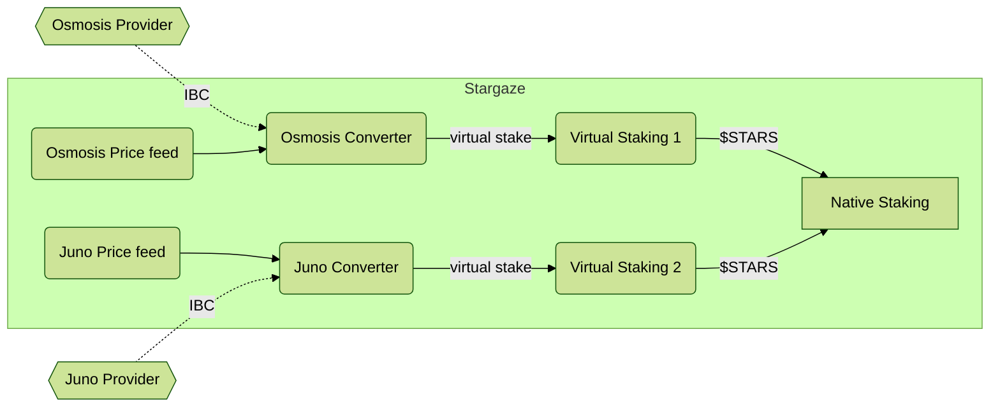

# Consumer

The consumer side of the system receives "virtual tokens" from
some trusted providers and uses those to update the local staking weights.
It then provides rewards to those providers in exchange for
the security promise it receives.

This is the other half of [the provider flow](../provider/Provider.md).

## Setup

### Contracts Setup

We must first instantiate a Price Feed contract(see [Price Normalization / Price Feeds](./Converter.md#price-feeds)),
and a [Virtual Staking](./VirtualStaking.md) contract must be stored on chain. So that we can get its code id.

Then the Converter contract is instantiated, which takes the address of the Price Feed contract, and the Code Id
of the Virtual Staking contract.
The Converter will then instantiate a Virtual Staking contract to work with it, as they both need references
to each other.
In addition to the Price Feed contract address and the code id of the Virtual Staking contract,
the Converter also needs the discount ratio, the remote denomination, and the admin of the Virtual Staking
contract, which is taken as an explicit argument, and normally will be the same admin of the Converter (but
could be a different one). This (wasm) admin is very important, as it is the only one who can migrate the Virtual
Staking contract if needed.

### IBC

After we [deployed the contracts](../ibc/Overview.md#deployment), an IBC channel can be setup between Converter on the Consumer
chain with an [External Staking](../provider/ExternalStaking.md) contract on the Provider. Once this
connection is established, Consumer governance can authorize this Converter with some ability to mint
on the [Virtual Staking](./VirtualStaking.md) contract.

When IBC connection is established from the Converter, the Provider side [External Staking](../provider/ExternalStaking.md)
contract must be already instantiated with the proper IBC channel information (i.e. proper connection id
and port id information in the `AuthorizedEndpoint` struct, set as part of their `InstantiateMsg`).
See the [Provider](../provider/Provider.md) Setup for more information.

Also, see [IBC Deployment](../ibc/ControlChannel.md#deployment) for more information on how the IBC connection is established.

## Converting Foreign Stake

Not all providers are treated equally. (And this is a good thing)

Each Converter accepts messages from exactly one provider and is
the point where we establish trust. The Converter is responsible for
converting the staking messages into local units. It does two transformations.
This first is convert the token based on a price oracle. The second step is to apply a discount,
which captures both the volatility of the remote asset, as well as
a general preference for local/native staking.

This is described more in depth under [Converter](./Converter.md#staking-flow).

## Virtual Staking

Once the Converter has normalized the foreign stake into the native staking units,
it calls into the associated [VirtualStaking](./VirtualStaking.md) contract in order
to convert this into real stake, without owning actual tokens. This contract must be
authorized to have extra power in a native Cosmos SDK module to have this impact, and has
a total limit of tokens it can stake. It performs 3 high level tasks:

- Staking "virtual tokens" as requested by the Converter (up to a limit).
- Periodically withdrawing rewards and sending them to the Converter.
- Unstaking "virtual tokens" as requested by the Converter. This must be immediate and
  avoid the "7 concurrent unbonding" limit on the `x/staking` module to be properly usable.
