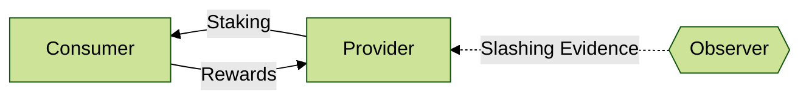

# IBC Protocol

Mesh Security is fundamentally an interchain-protocol,
and it is important to define the exact mechanics of
how the different subsystems interact.

Here were are focusing just on the dotted lines, that
we abstracted away when focusing on [Providers](../provider/Provider.md)
and [Consumers](../consumer/Consumer.md).

Fundamentally there are these two flows, although slashing
is also done cross chain, but outside IBC (by external observers).
For the time being, we focus on the two IBC data flows
and discuss cross-chain slashing in another section.

## Deployment

As mentioned in [the consumer section](../consumer/Consumer.md),
we need to establish a trust relationship between the Provider side and the Consumer side. This is done in multiple stages.

I refer to "Admin" here in most of the setup, which can be any address that can make calls on two chains.
It is responsible for proper configuration, but revokes all its power before the Provider-Consumer pairing has any
voting power (permitted to virtually stake). It can be a normal account, a ledger, a Cosmos SDK native multisig,
a DAO using ICA to act on two chains. In theory this could be on-chain governance, but that would be unwieldy.

I recommend using the approach of a single actor deploying (for simplicity), then using governance to authorize
the connection once it is all configured (for security).

Establish a channel (allow list):

1. Admin deploys _Converter_ and _Virtual Staking_ on the Consumer side, both referencing each other.
2. Admin deploys _External Staker_ on the Provider side, registering `(connection, port)`
   from _Converter_ contract from (1).
3. Admin updates _Converter_ (1) to allow the `(connection, port)` from (2).
4. Anyone establishes a new channel between _Converter_ and _External Staker_.
   Both contracts ensure the other side matches the stored `(connection, port)` and refuse the channel otherwise.
5. Neither contract accept any more channels. They only accept one channel and only what matches their config.

Now that we have a channel and know which contract is talking to whom, we need
to authorize them:

1. Admin removes their admin rights on both contracts. Or passes to chain governance; it would be
   unwise to not have any admin, as this would prevent on-chain migrations.
2. Due diligence performed on configuration of both contracts and the channel. Parties from both chains
   can verify the contract code and configuration.
3. Consumer chain governance votes to authorize this _Virtual Staking_ contract to have special
   privileges on the staking system (see [Virtual Staking](../consumer/VirtualStaking.md)).
4. Authorization on the Provider chain [is not required](https://github.com/CosmWasm/mesh-security/blob/begin-architecture/docs/provider/Vault.md#design-decisions),
   but the default cross-stake frontend application should add the _External Staker_ to the recommended list.

Once this has been completed, everything is set up and the token holders on the Provider side
can now safely cross-stake on the Consumer side with one click.

Note that the majority of the setup is permissionless. And it just requires one governance vote on the
Consumer side to authorize the ability to stake virtual tokens, which is essential for any security guarantees.
No forks, no complicated processes... just one proposal.

## Protocol design

We use this custom channel to communicate securely and directly
between the two sides, sending messages about bonding and unbonding
delegations, validator updates, and possibly more. This is the
principle form of communication, called the
[Control Channel](./ControlChannel.md), and is the core
piece of the Mesh Security IBC protocol.

We send reward amounts over the Control Channel from the Converter contract
in the Consumer side to the External Staking contract on the Provider side, so that
they can be distributed by the Provider side. The Provider side
indicates in turn to the Consumer side which users should receive rewards.
Read more about the [Cross-Chain Rewards Protocol](./Rewards.md).

Finally, slashing is not in-protocol, so a malicious Consumer chain
cannot slash an honest delegator. Rather, an external observer must
submit evidence of a double sign on the Consumer chain directly to
the Provider chain. With that direct proof, it will take action to slash
the appropriate stake. We explain this design more in "Trust Assumptions" below.
Read more about the mechanics of the [Slashing Evidence Handling](./Slashing.md).

## Trust Assumptions

The [top-level introduction covers many concerns](../README.md#common-concerns)
about possible exploits in the trust relationship between Consumer and Provider.
