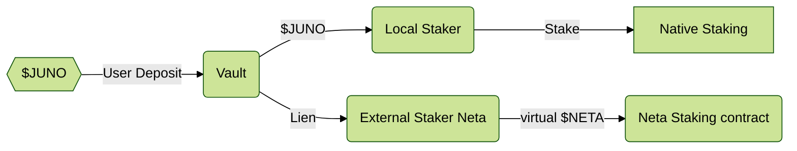
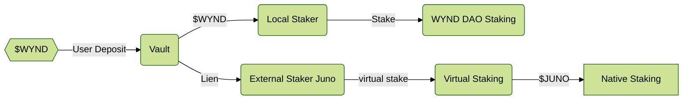

# DAO DAO Extension

After discussing this general diagram, we realized there is some value in
a simplified version of this, which may also be a great starting place to
testing out UX without the complications of IBC. DAOs have their own
token, governance, staking, and reward contracts. We can compare them to
low-cap chains embedded in a host chain. Let's look at two ways of using DAOs locally

This document holds some brainstorm idea of how one might reuse much of the
design but customize some pieces to allow DAOs partially secured by native
tokens, or let huge DAOs provide security to the chain they run on.
None of this is fleshed out or on the road map, but is here to give
an idea on the flexibility of Mesh Security and may inspire someone
to develop it further

## Bootstrapping DAOs

When a new DAO launches, it often wants to accomplish two things:

1. Ensure a reasonable security for the DAO (regardless of low market cap)
2. Airdrop some tokens to native stakers.

By using a variant of mesh security, they can do both, acting as a
consumer of security from the native staking tokens to provide a solid
base security amount. And also, providing a share of their rewards
to those $JUNO cross-stakers, effectively airdropping those tokens
(at zero cost to the recipient) for providing some initial security.
It would look like this:

Note that this requires the exact same Vault and Local Staker
as the real use case, and uses the same External Staker interface.
The "Neta Staking" contract is already built and by building out
this "External Staker Neta" adapter contract, we can work through
all the design issues in a local environment (where we can easy get
coverage with `cw-multi-test`), as well as start building out a
single-chain demo UI, where we can start discovering and resolving
the UX issues in explaining such a system.

This may force a bit more abstraction in the system, as
"external staker Neta" doesn't take a validator as an argument,
it just stakes. Without delegation, this also brings up many questions
about governance power and such, which may be easier to prototype
in DAO contracts than modifying the Cosmos SDK staking module.

**Recommendation** Once the MVP Vault is built, it would be good to assign
one contract dev to work out this External Staker implementation to
some standard DAO DAO staking contract (can be a "hacked" version that
just holds a lot of the DAO token, like we did in HackWasm Medellin).
This will unblock frontend developers and allow us to get much quicker
feedback on UX issues in such a system, while the backend engineers
are working with the complexities of IBC and staking virtual tokens in
the native SDK staking module.

We don't develop this to production quality, but use it
as a proof-of-concept to get some hands on feedback on how to deal
with various issues here like different unbonding periods and
what to do about governance power.

## Mega DAOs

If a DAO has a market cap approaching the TVL staked in the native token, this
becomes a dangerous situation for the DAO as the security provisioned by the chain
is insufficient to protect it from attacks. We could turn this model around and allow
the DAO token to "externally stake" on the local staking contract.

Note this would require a different implementation for vault (to handle cw20),
and likely a different "local staker" interface (you don't select validators, but rather unbonding time).
The "External Staker JUNO" would be similar to the normal [Receiver model](../consumer/Receiver.md)
and we will need a full implementation of the [Consumer side](../consumer/Consumer.md)
implemented on the same chain.

**Recommendation** We do not build this either as MVP or v1, and view later if it makes
sense at all. However, we should consider this use case in our designs to ensure our interfaces
and invariants make this possible.
