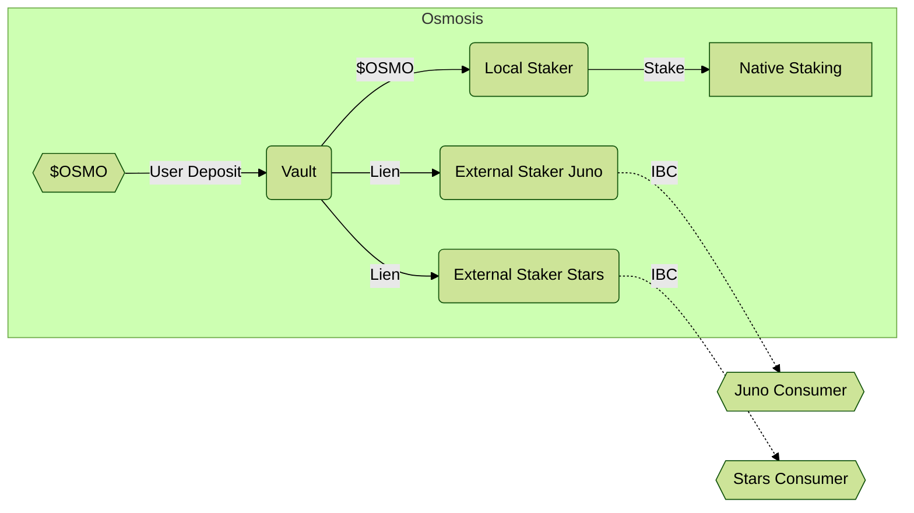

# Provider Overview

Here is a brief overview of the architecture on the provider side
before we dig into the function of each of the components.

The standard case is a vault on the provider chain enabling
staking the native token locally, as well as staking "virtual tokens"
on multiple external chains connected via IBC:

## Flows

The first action the user must undertake is depositing
the native staking token into the vault. This must be liquid
(unbonded and fully vested). This gives them a credit on the vault,
which they can withdraw assuming there are no outstanding liens on that amount.
[Read more about the vault](./Vault.md).

Each vault contains _exactly one_ denom and has _exactly one_ local staking
module. This local staker can stake the vault token with the
native staking module. It actually accepts the original token, which makes
it different than external stakers, which accept liens. By depositing in the vault
and staking in the local staker, I will have achieved the same effect
(and get the same rewards) as directly staking... but I can now use my balance
for more.
[Read more about local staking](./LocalStaking.md).

The external stakers allow us to cross-stake the native vault
token on other chains (or other DAOs) that use a different native
staking token, but have opted in to accepting a portion
of their security from this vault in exchange for a portion
of their rewards. In the basic model, these accept a lien
from the vault and will communicate with a consumer interface
to inform how much stake is locked to which validator and
to receive rewards.
[Read more about external staking](./ExternalStaking.md).

The connection to the consumer is over IBC and the consumer is
responsible for converting these "virtual tokens" into delegations
in the native staking module. Note that the consumer must first opt-in to
accept the provider's tokens and can place multiple restrictions and limits
on to how much power can be granted into any external chain.
[Read more about consumers](../consumers/Consumer.md).

## Stakers and Governance

Both [local stakers](./LocalStaking.md) and [external stakers](./ExternalStaking.md)
allow the user to bond to the validator of their choice on the associated chain.
The question arises as to what influence the cross-staked user can have on chain governance.

For MVP, all these delegations provide full governance power to the validator
that was selected, but the cross-staker may not directly vote
on any of these issues (they inherit the validator's vote).

For local staking (in the native token), the cross-staker has the
same governance rights as if they had staked directly. They can vote
on governance proposals to override the validator's voice if they desire.
They may also restake with the same restrictions as normal (once per
unbonding period), and naturally unstake when they want.

For external staking, the cross-staker will never be able to override
the vote, as they are not expected to be very active in local governance
on these external protocols. (If they want to participate, they can take the
cross-staking rewards and delegate those tokens directly to get a voice.)

**Desired goal by v2:**

There will be two supported configurations for external staking.
Either the cross-staked tokens provides governance voting power
to the validator in the same proportion that it provides Tendermint voting power.
Or the cross-staked tokens only provide Tendermint voting power (security)
without granting more governance power to that validator.
There are [use cases](../UseCases.md) for each configuration.

It is unclear if this is possible without forking the governance module
and design work is [tracked in this issue](https://github.com/osmosis-labs/mesh-security-sdk/issues/48)

## Optional Extensions

These won't be included in MVP and require more modifications
to the core Cosmos SDK modules, which makes them more risky and
more difficult to port to other chains. But could be considered
as chain-specific extensions.

- Enable moving bonded tokens directly into the vault? (Custom SDK change)
- Allow depositing vesting tokens to the vault? (deeper SDK change)
