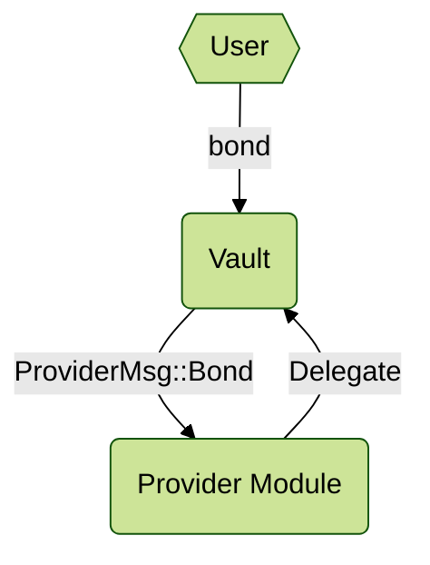
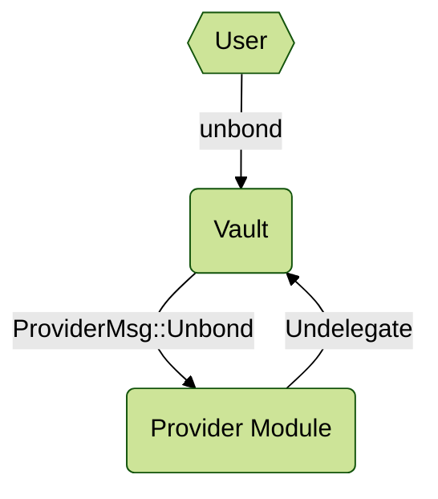
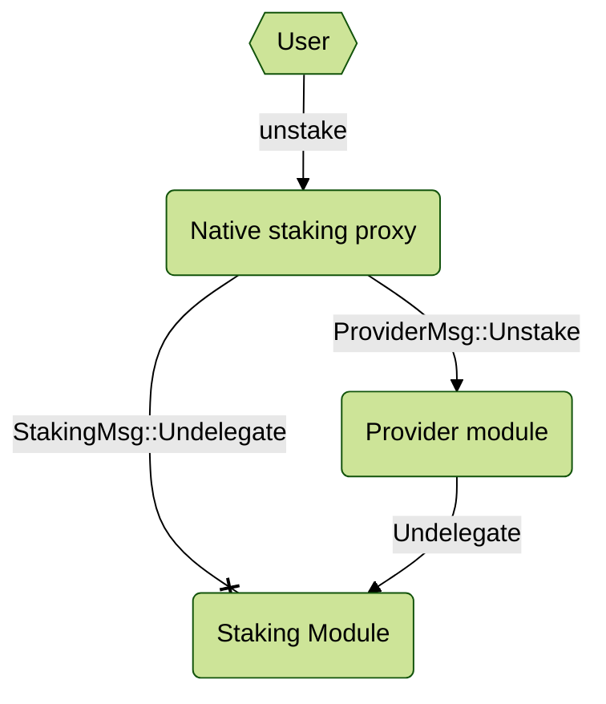
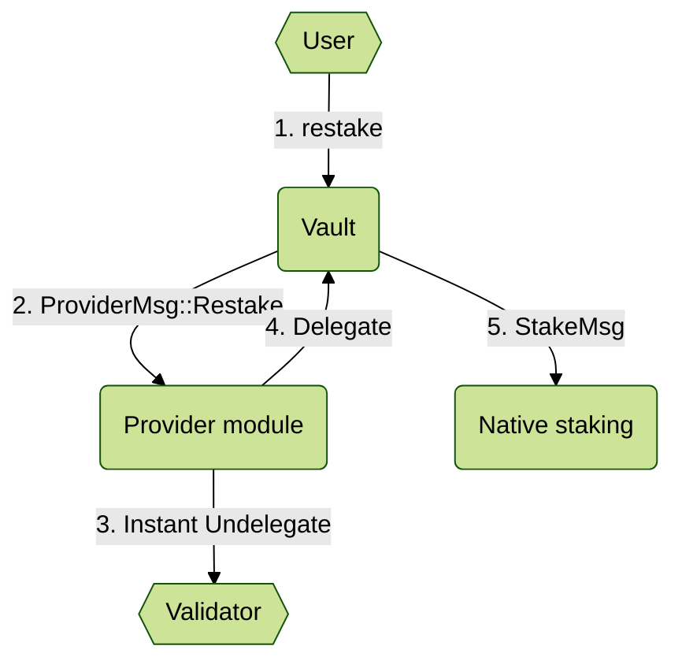
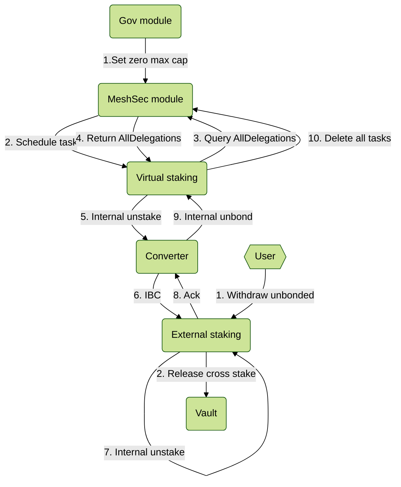

### [Allow depositing vesting tokens in the vault](https://github.com/osmosis-labs/mesh-security/issues/90)

#### Bonding

Rather than directly transferring funds when invoking the `bond` method, users specify the amount of tokens they wish to deposit into the `Vault` contract. The `Vault` contract then issues a custom message, `ProviderMsg::Bond`, to the Provider module. This module manages both the user's vesting and transferable tokens, coordinating with the Bank module to delegate tokens from the user's account to the `Vault` contract address.
#### Unbonding

When a user wishes to retrieve their tokens, they simply invoke the `unbond` method on the `Vault` contract. The `Vault` contract validates the user's available withdrawable balance, and upon successful validation, issues a custom message, `ProviderMsg::Unbond`, to the Provider module. The Provider module then interacts with the Bank module to undelegate the tokens from the `Vault` contract address back to the user's account. After this process, the user receives both their vesting and transferable tokens that were previously bonded.

With this process, users can engage with other methods available in the `Vault` contract without distinction between vesting and transferable tokens, as both types of tokens are treated uniformly once bonded and can be utilized seamlessly within the contract. And the Provider module must define the Vault contract address by configuring it via the MsgUpdateParams.

#### Messages
- `bond` method has been modified as follows:

|     | Parameters     | Funds |
|-----|----------------|-------|
| Old | []             | Yes   |
| New | [amount: Coin] | No    |


### [Native "immediate unbonding" mechanism](https://github.com/osmosis-labs/mesh-security/issues/175)
#### Flow


To implement an instant undelegation feature, when a user invokes the `unstake` method on the `native staking proxy` contract, instead of sending a `StakingMsg::Undelegate` to the staking module, the contract will issue a custom message, `ProviderMsg::Unstake`, to the Provider module. The Provider module will then validate the unbond amount and immediately undelegate the tokens from the validator if the validator has already been unbonded. To ensure that the contract call is originating from the authorized `native staking proxy` contract, the Provider module will query the `native staking` contract, as specified via `MsgUpdateParams`, and verify that the caller is indeed the `native staking proxy` contract associated with the delegator.

### [Transition stake](https://github.com/osmosis-labs/mesh-security/issues/89)
#### Flow


When users have tokens already staked, they can transfer those tokens to the `Vault` and restake them with the same validator by invoking the `restake` method on the `Vault` contract. This method will record the bonding amount and send two messages. The first message is sent to the Provider module, which, upon receipt, will verify the unbonding amount and confirm that the caller is the authorized `Vault` contract, as specified through `MsgUpdateParams`. The Provider module will then instantly undelegate the user's existing delegation and re-delegate those tokens to the `Vault` contract. The second message is sent to the `native staking` contract to manage the staking of tokens with the same validator.

#### Messages
- New `restake` method has been established as follows:

| Parameters | Type   |
|------------|--------|
| amount     | Coin   |
| validator  | String |
 

### [Zero max cap](https://github.com/osmosis-labs/mesh-security/issues/100)
#### Flow


In order to let the contract know about the delegation of each user to each validator, we added **`UpdateDelegation`** msg. The msg will set delegation on consumer chain when user **`Bond`** or **`Unbond`**. With that, when the cap is set to zero, contract can use **`AllDelegations`** query to get all delegations saved. Due to virtual staking and converter contract does not save delegator info in its own state, we need to resend the msg to external staking contract. After external staking is called via ibc, converter contract get the Ack message, if it success, a msg to virtual staking contract will be executed to unbond the given amount by delegator. 

On the next schedule task, if query **`AllDelegations`** returns empty, that mean all users's delegation has been unbond completely, virtual staking contract will send **`DeleteScheduledTasks`** to mesh security module and stop creating tasks.
#### Messages
- `AllDelegations` query msg has been established as follows:
AllDelegationsQuery:

| Parameters | Type   |
|------------|--------|
|Contract    | String |
|MaxRetrieve | uint16 |

AllDelegationsResponse:

| Parameters | Type         |
|------------|--------------|
| Delegations| [Delegation] |

Delegation:

| Parameters | Type   |
|------------|--------|
|Delegator   | String |
|Validator   | String |
|Amount      | String |

- `UpdateDelegation` msg has been established as folows:

| Parameters | Type   |
|------------|--------|
|Amount      |Coin    |
|IsDeduct    |bool    |
|Delegator   |String  |
|Validator   |String  |

### [Auto unbond tombstoned validators](https://github.com/osmosis-labs/mesh-security/issues/154)

We had modifed [inactive list](https://github.com/osmosis-labs/mesh-security/blob/c170596e515dd9f2247a1de26097c10104b2e6a1/contracts/consumer/virtual-staking/src/contract.rs#L47) in virtual-staking to check if a validator is tombstoned or not. If validator is tombstoned, the `handle_epoch` function will query `TotalDelegation` from mesh scecurity module to get the amount should be unbond and unbond it automatically. As we save `tombstoned_unbond_enable` when instantiate contract, blockchain implementations may decide to unbond automatically when tombstoning.

#### Messages
- `TotalDelegation` query msg has been established as folows:
TotalDelegationQuery:

| Parameters | Type   |
|------------|--------|
|Contract    | String |
|Validator   | String |

TotalDelegationResponse:

| Parameters | Type   |
|------------|--------|
|Delegation  | Coin   |


### [Handle slashing from provider chain to native slashing contract]()
Slashing events can be forwarded to the contracts for processing by `JailingMsg`:
```go
SudoMsg struct {
		Jailing *ValidatorSlash `json:"jailing,omitempty"`
	}
	// ValidatorAddr alias for the Bech32 address string of sdk.ValAddress
	ValidatorAddr = string

	ValidatorSlash struct {
		Jailed     []ValidatorAddr `json:"jailed"`
		Tombstoned []ValidatorAddr `json:"tombstoned"`
	}
```

Using Staking Decorate, we modify the SlashWithInfractionReason function. This change enables forwarding of slashing events to the contract via `JailingMsg`. The slashing handler on the contract side has already been implemented in https://github.com/osmosis-labs/mesh-security/issues/129.

### [Multitest improvement](https://github.com/osmosis-labs/mesh-security/issues/95)

Due to current sylvia version does not support multitest in IBC, and the issue [sylvia #206: msg(exec) macro conditional](https://github.com/CosmWasm/sylvia/issues/206) is not resolved yet, we are only able to finish the work [remove the virtual staking mock](https://github.com/osmosis-labs/mesh-security/pull/200). 
